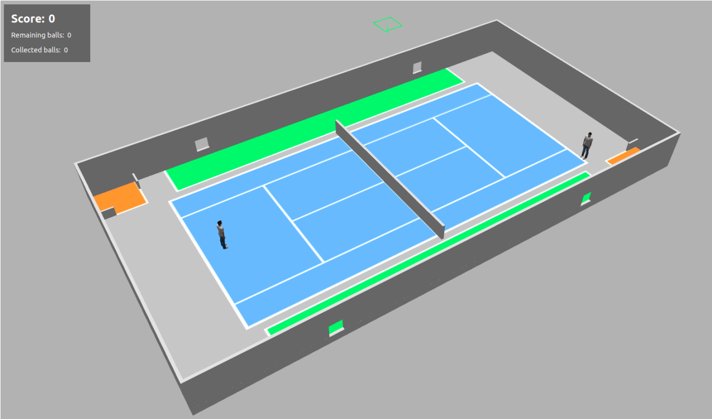

# Robotisation de la collecte de balles de tennis 

*Ingénierie Système et Modélisation Robotique 2022-2023*

## Nouvelles spécifications 

La simulation va maintenant imiter le déroulement d’un match de tennis, avec des pauses et des échanges. Afin de ne pas gêner les joueurs, le robot devra impérativement se positionner dans les zones vertes pendant les échanges. Le robot doit alors profiter des pauses entre les échanges pour collecter les balles jouées. 

Le match alternera entre des périodes d’échanges d’**une minute** et des pauses de **deux minutes**. L’état du match est publié dans le topic `/game_ status` avec la *QoS* suivante : 

- **Reliability** : Best Effort 
- **Durability** : Transient Local 

Le message publié est de type `tennis_court/msg/GameStatus` et contient un booléen **is_started** indiquant si l’échange a commencé ou non.

Une fois l’échange initié, le robot a **30 secondes** pour rejoindre l’une des deux zones vertes, ensuite le score diminue. A l’inverse, le score augmente lorsque le robot est dans une zone verte pendant un échange. 

L’état du match est affiché dans la fenêtre de Gazebo et peut prendre trois valeurs différentes : 

- **Paused** : Phase de pause, le robot peut collecter les balles. 
- **Starting** : L’échange vient de commencer, le robot doit rejoindre une zone verte mais n’est pas pénalisé. 
- **Started** : Le robot doit être dans une zone verte, il est pénalisé si ce n’est pas le cas.