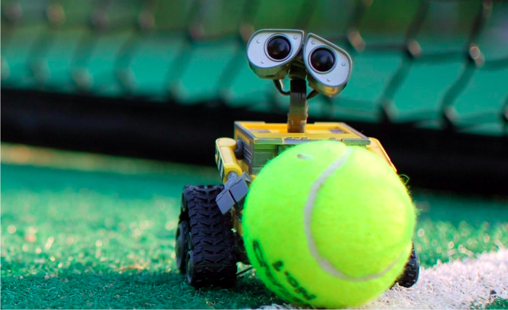

# Robotisation de la collecte de balles de tennis

*Ingénierie Système et Modélisation Robotique 2022-2023*

### Résumé

En utilisant une méthode de développement agile, votre équipe, constitué de 4 à 6 membres, devra concevoir un robot dédié à la collecte de balles de tennis. Ce dernier devra être capable de détecter les balles, les localiser, puis de les déplacer jusqu’à une zone de stockage. Les spécifications du déroulement du projet sont détaillées ci-après.

## 1. Dépot git

- Créer une organisation sur Github et ajouter tous les membres du groupe avec le rôle d’administrateur. 
- Réaliser un **fork** de [https://github.com/nathan-teaching/CollecteBalle](https://github.com/nathan-teaching/CollecteBalle) sur votre organisation. **Activer les Issues** (Settings -> Cocher la case *Issues*)
- Chaque membre **fork** le dépot **CollecteBalle** de l'organisation sur son compte personnel. Chacun travaillera ensuite sur son propre **fork** associé à son compte personnel. 

Il est important de parcourir tout le dépôt et de lire tous les `README` afin de bien comprendre sa structure. Compléter le `README` principal avec les membres du groupe, et plus tard avec le lien vers la gestion de projet sous **Taiga**. 

La partie **Lancer la simulation** devra être à jour à tout moment du projet.

Les contributions de chacun seront intégrées par le biais de **Pull Requests**, il est donc nécessaire que chaque membre du groupe travaille sur son propre
**_fork_ du dépôt de l’organisation** (pas le dépôt global). Les **Pull Requests** ne pourront être acceptées que par le **Product Owner**.

Seule la branche **main** du _fork_ associé à votre organisation sera prise en compte pour juger de la réussite de votre projet, veiller à ce que celle-ci soit toujours à jour en fin de sprint, fonctionnelle, et comporte les différents rapports à compléter durant le projet. 

A noter qu’il est possible que des changements soient effectués sur le dépôt original, il faudra alors intégrer ces changements dans vos différents **forks**.

## 2. Gestion de projet Agile

La gestion de projet se fera avec la méthode agile _Scrum_ où un sprint correspondra à une demi-journée de développement. La gestion de projet se fera sur l’outil web

[**Taiga**](https://tree.taiga.io/), chaque groupe doit créer un projet public en mode _Scrum_.

#### Chaque sprint se déroule comme suit :

- Désignation d’un **Product Owner** en charge de la gestion de projet pour ce sprint
- Spécification des objectifs du sprint, rédiger un rapport en utilisant le fichier `GoalsTemplate.md` comme modèle (nommer ce fichier `XX_Goals.md`
  où **XX** est le numéro du sprint)
- Création du sprint sous **Taiga**
- Report des fonctionnalités (**User stories**) et des tâches (**Subtasks**) dans le sprint sous **Taiga**
- **Pour le PO : Rendez-vous avec le client**
- **Pour les autres : Réalisation de leurs tâches**
- En fin de demi-journée, rédaction d’une revue de sprint en utilisant le modèle `DebriefTemplate.md` (nommer ce fichier `XX_Debrief.md` où **XX** est le
  numéro du sprint)

A noter que les différents rapports doivent impérativement être envoyés sur le dépôt Git distant à chaque début et fin de sprint, dans le dossier **reports**.

## 3. Objectifs 

L’objectif principal est de concevoir et modéliser un robot dans Gazebo dédié à la collecte de balles de tennis. Pour cela, un package ROS vous est fourni, il comporte les éléments suivants: 

- Un monde Gazebo comportant un court de tennis fermé avec deux zones de stockage marquées par une signalisation au sol de couleur orange et une caméra zénithale 

- Un plugin visuel pour Gazebo affichant le score, le nombre de balles collectées ainsi que le nombre de balles restantes 

- Un script pour la création aléatoire de balles de tennis 

  

  Figure 1: Le monde **court.world** dans Gazebo

Au cours de la simulation 10 balles apparaîtront une par une dans le court, le robot devra alors déplacer chaque balle dans l’une des deux zones de stockage marquées en orange. Les balles doivent rester pendant 5 secondes à l’intérieur d’une zone avant d’être considérées comme collectées. Collecter une balle augmente votre score, la quantité de points gagnée varie en fonction de deux facteurs: 

- Le temps écoulé entre l’apparition de la balle et sa collecte 
- Le temps écoulé entre le début de la simulation et la collecte de la balle 

A noter que les points associés au premier facteur sont plus importants, il est donc préférable de prioriser les balles en fonction de leur ordre d’apparition. 

## 4. Le robot 

La seule contrainte est que vous devez concevoir un robot terrestre à roues. Le mécanisme de collecte des balles ainsi que la stratégie employée sont complètement libres. Tous les capteurs sont autorisés, ainsi que tous les packages ROS 2 que vous jugerez pertinents. Le robot ne doit pas recourir à des capteurs extérieurs à l’exception de la caméra zénithale. La collecte doit être réalisée par une unique instance du robot.

## Auteurs et Contributeurs
[RemiRigal](https://github.com/RemiRigal) [TilletJ](https://github.com/TilletJ) [nathanfourniol](https://github.com/nathanfourniol) [KevinBdN](https://github.com/KevinBdn) [ThomasLeMezo](https://github.com/ThomasLeMezo)